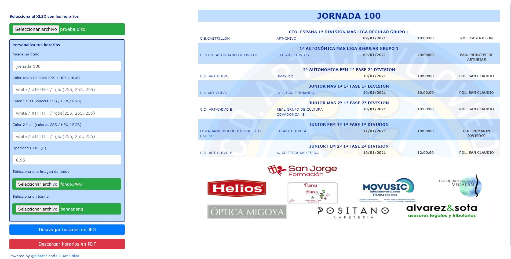

# Personaliza tus horarios FBPA con el pARTseador
## Índice

* [Qué es](#que-es)
* [Cómo se usa](#como-se-usa)

## Qué es
El pARTseador te permite convertir el PDF suministrado por la Federación de Baloncesto del Principado de Asturias en una foto u otro PDF personalizado con el logo y los colores de tu club, en número de jornada y el baner con tus patrocinadores.

## Cómo se usa
1. Descarga el zip con la aplicación haciendo clic aquí: <a href="https://github.com/albact7/parser-horarios-fbpa/archive/1.0.zip">DESCARGAR</a> y descomprímela en tu equipo.
2. Haz doble clic sobre el archivo "pARTseador", se abrirá una ventana de tu navegador predeterminado. 
Si tu ordenador no reconoce el tipo de archivo o prefieres abrirlo con otro navegador: clic sobre él con botón derecho, "Abrir con" y eliges tu navegador.
3. Verás en tu navegador algo similar a esto:

  

4. En la columna de la izquierda se encuentran todas las opciones disponibles de la aplicación, comencemos a personalizar los horarios.
5. Descarga de la página de la FBPA el archivo XLSX con tus horarios.
6. Haz clic en "Seleccionar archivo" y selecciona el archivo que acabas de descargar.
7. En los siguientes recuadros añade la correspondiente información (adjuntamos entre paréntesis los valores por defecto), a la derecha tendrás la previsualización de tus horarios:
    * Nombre de la jornada (Jornada 1)
    * Color del texto (#001F96)
    * Color 1 de filas(white)
    * Color 2 de filas(rgba(191, 220, 254))
    * Fondo de los horarios (Escudo CD Art-Chivo)
    * Banner de publicidad (Colaboradores del CD Art-Chivo)
8. Descarga tus horarios ya personalizados en JPG o PDF.
9. Si utilizas el pARTseador, comparte este link en redes sociales si puedes ;)

Disclaimer: esta herramienta sólo pretende ayudar desinteresadamente a los clubes asturianos, el contenido de los horarios pertenece a la Federación de Baloncesto del Principado de Asturias.
